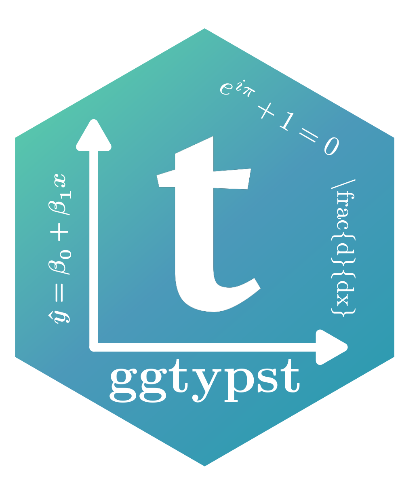

```{r setup, include=FALSE}
knitr::opts_chunk$set(
  collapse = TRUE,
  comment = "#>",
  fig.path = "man/figures/README-",
  dpi = 144
)
```

# ggtypst 

**`ggtypst`** brings Typst-powered high-quality text and math rendering to `ggplot2`.
Without requiring a separate local Typst or LaTeX setup, you can add rich text and math
equations directly to your `ggplot2` plots through three public API families:

- `annotate_*()` for one-off annotations
- `geom_*()` for data-driven text layers
- `element_*()` for Typst-rendered theme text

`ggtypst` supports both native Typst math and **LaTeX-style math**
thanks to [MiTeX](https://github.com/mitex-rs/mitex). Just choose one math style you are
more familiar with. 

ℹ️*For showcases, please see [Showcase](#showcase) below.*

## Highlights

Typst gives you expressive text layout, math typesetting, programmable markup and high-quality rendering in a compact syntax. `ggtypst` uses
that strength inside `ggplot2` without asking you to leave the plotting pipeline.

- ✍️ Write raw Typst markup directly inside `ggplot2`
- ⚙️ Render high-quality equations without installing Typst or LaTeX separately
- 📊 Plot rich titles, axis, facets, and legends with Typst contents
- 🎨 Customize text size, colors, angles, faces, and families freelyilies freely
- 🔁 Choose native Typst math or LaTeX-style math, depends on your wish
- 🧩 Keep the familiar `ggplot2` layout system and theme semantics

## Installation

For now, install `ggtypst` from GitHub with `remotes::install_github()`:

```{r install, eval=FALSE}
install.packages("remotes")
remotes::install_github("Yousa-Mirage/ggtypst")
```

`ggtypst` builds a Rust backend during installation, so you need an available
Rust toolchain with `rustc` on your system. You can install Rust easily
through [rustup](https://rust-lang.org/tools/install/).

Binary/package distribution through r-universe and r-multiverse is planned for later.

## Get Started

Please read [Get Started](https://yousa-mirage.github.io/ggtypst/articles/get-started.html) to get a detailed guide for
`ggtypst`. There you will see some instructions and examples about how to
use `ggtypst` in `ggplot2` to plot rich contents.

## Showcase

With `ggtypst`, you can easily make publication-ready scientific figures with excellent
rich texts and math equations. There are three plots as showcases about the three main
workflows: annotations, data-driven labels, and Typst-powered theme elements.

### Annotation: Just add something

`annotate_typst()`, `annotate_math_typst()`, and `annotate_math_mitex()` let
you place rich notes, callouts, or equations at precise plot locations.


### Geom: Data-driven labels

`geom_typst()`, `geom_math_typst()`, and `geom_math_mitex()` turn Typst labels
into real plotting layers, so styling and label content can vary row by row.


### Element: Render theme elements

`element_typst()`, `element_math_typst()`, and `element_math_mitex()` take
over the themes and rendering of titles, axis labels, strips, and legends.
You can even render a matrix as the title!


## Contributing

If you found any bugs or errors about `ggtypst`, you can report it on [GitHub Issues](https://github.com/yousa-mirage/ggtypst/issues/).
Remember to attach an image and the reproduction code to show the issue clearly.

If you want to make contributions, please take a look at the [contributing guide](https://yousa-mirage.github.io/ggtypst/CONTRIBUTING.html) for instructions.

## Acknowledgements

`ggtypst` would not exist without two excellent upstream projects:

- [Typst](https://github.com/typst/typst) for the rendering engine and typography system
- [MiTeX](https://github.com/mitex-rs/mitex) for LaTeX-to-Typst math conversion

The icon of `ggtypst` is made by [`hexSticker`](https://github.com/GuangchuangYu/hexSticker), designed by
[Yousa Mirage (myself)](https://github.com/Yousa-Mirage).