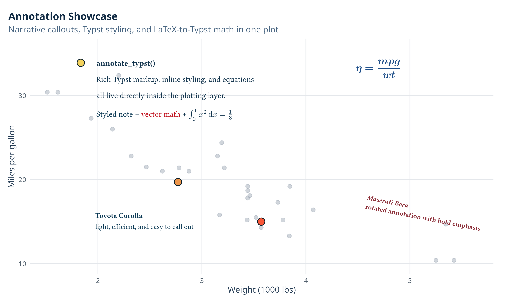
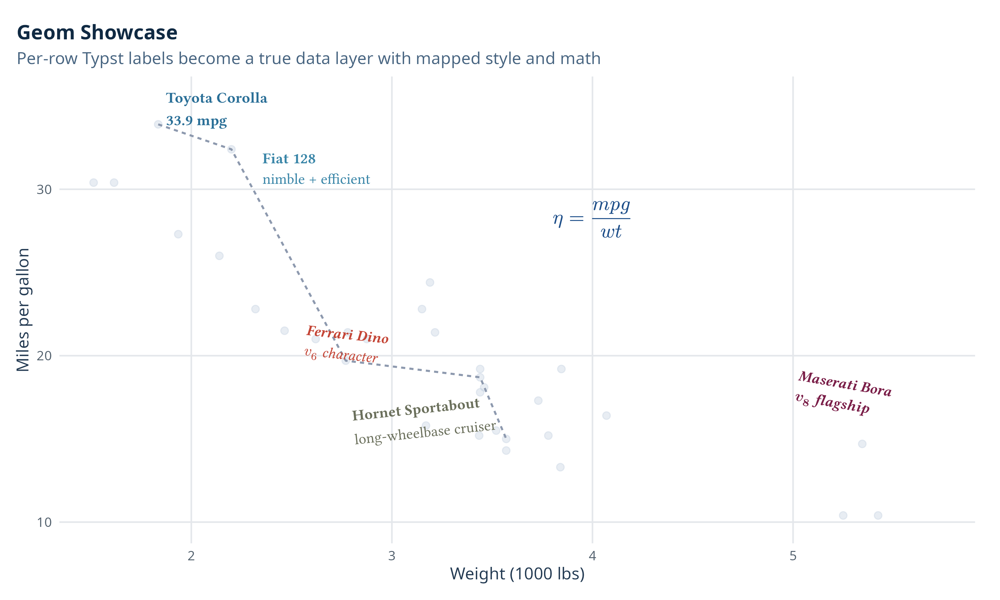
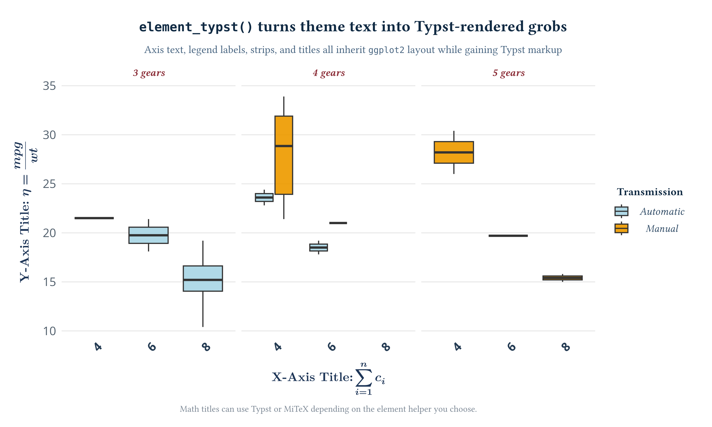

# ggtypst

**`ggtypst`** brings Typst-powered text and math rendering to `ggplot2`.
`ggtypst` is built around three public API families:

- `annotate_*()` for one-off annotations
- `geom_*()` for data-driven text layers
- `element_*()` for Typst-rendered theme text

The package supports both **native Typst math** and **LaTeX-style math**
converted through [MiTeX](https://github.com/mitex-rs/mitex), which
makes it useful for scientific plots, teaching material, technical
dashboards, and publication-ready figures.

Under the hood, an embedded Rust backend renders Typst output to SVG
grobs, so the result fits naturally into normal `ggplot2` workflows
**without requiring a separate local Typst or LaTeX setup**.

:information_source: *For showcases, please see [Showcase](#showcase)
below.*

## Highlights

Typst gives you expressive text layout, math typesetting, programmable
markup and high-quality rendering in a compact syntax. `ggtypst` uses
that strength inside `ggplot2` without asking you to leave the plotting
pipeline.

- ✍️ Write raw Typst markup directly inside `ggplot2`
- ⚙️ Render high-quality equations without installing Typst or LaTeX
  separately
- 📊 Plot rich titles, axis, facets, and legends with Typst contents
- 🎨 Customize text size, colors, angles, faces, and families
  freelyilies freely
- 🔁 Choose native Typst math or LaTeX-style math, depends on your wish
- 🧩 Keep the familiar `ggplot2` layout system and theme semantics

## Installation

For now, install `ggtypst` from GitHub with `remotes::install_github()`:

``` r
install.packages("remotes")
remotes::install_github("Yousa-Mirage/ggtypst")
```

`ggtypst` builds a Rust backend during installation, so you need an
available Rust toolchain with `rustc` on your system. You can install
Rust easily through [rustup](https://rust-lang.org/tools/install/).

Binary/package distribution through r-universe and r-multiverse is
planned for later.

## Get Started

Please read [Get
Started](https://yousa-mirage.github.io/ggtypst/articles/get-started.html)
to get a detailed guide for `ggtypst`. There you will see some
instructions and examples about how to use `ggtypst` in `ggplot2` to
plot rich contents.

For detailed documentation of functions and the code architecture of
`ggtypst`, please also see the [website
page](https://yousa-mirage.github.io/ggtypst/).

## Showcase

There are three plots as showcases about the three main workflows:
annotations, data-driven labels, and Typst-powered theme elements.

### Annotation: Just add something

`annotate_typst()`, `annotate_math_typst()`, and `annotate_math_mitex()`
let you place rich notes, callouts, or equations at precise plot
locations.



### Geom: Data-driven labels

`geom_typst()`, `geom_math_typst()`, and `geom_math_mitex()` turn Typst
labels into real plotting layers, so styling and label content can vary
row by row.



### Element: Render theme elements

`element_typst()`, `element_math_typst()`, and `element_math_mitex()`
take over the themes and rendering of titles, axis labels, strips, and
legends. You can even render a matrix as the title!



## Contributing

If you found any bugs or errors about `ggtypst`, you can report it on
[GitHub Issues](https://github.com/yousa-mirage/ggtypst/issues/).
Remember to attach an image and the reproduction code to show the issue
clearly.

If you want to make contributions, please take a look at the
[contributing
guide](https://yousa-mirage.github.io/ggtypst/CONTRIBUTING.html) for
instructions.

## Acknowledgements

`ggtypst` would not exist without two excellent upstream projects:

- [Typst](https://github.com/typst/typst) for the rendering engine and
  typography system
- [MiTeX](https://github.com/mitex-rs/mitex) for LaTeX-to-Typst math
  conversion

Thanks to the Typst and MiTeX maintainers and contributors for building
the underlying tooling that makes this package possible.
